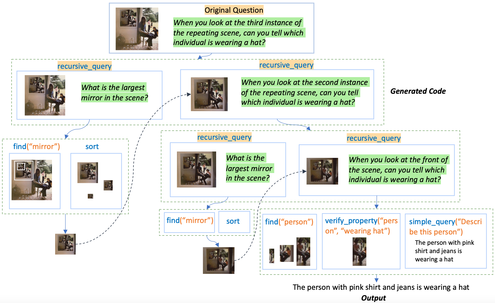

# RVP: Recursive Visual Programming

This is the code for the paper [Recursive Visual Programming](https://arxiv.org/abs/2312.02249) by [Jiaxin Ge](https://jiaxin.ge/)\* [Sanjay Subramanian](https://people.eecs.berkeley.edu/~sanjayss/)\* [Baifeng Shi](https://bfshi.github.io/)\* [Roei Herzig](https://roeiherz.github.io/)\* [Trevor Darrell](https://people.eecs.berkeley.edu/~trevor/).



## Quickstart
Clone recursively:
```bash
git clone --recurse-submodules https://github.com/para-lost/RVP.git
```

After cloning:
```bash
cd RVP
export PATH=/usr/local/cuda/bin:$PATH
bash setup.sh  # This may take a while. 
cd GLIP
python setup.py clean --all build develop --user
cd ..
echo YOUR_OPENAI_API_KEY_HERE > api.key
```

### Dependencies

First, create a conda environment using `setup_env.sh` and then install our modified version of GLIP. 
To do so, just `cd` into the `RVP` directory, and run:

```bash
export PATH=/usr/local/cuda/bin:$PATH
bash setup_env.sh
conda activate rvp
cd GLIP
python setup.py clean --all build develop --user
```

Please make sure to install GLIP as described.

### Pretrained models

The repo inherit from [ViperGPT](https://github.com/cvlab-columbia/viper) and contains all the pretrained models in ViperGPT. This includes models such as BLIP and GLIP, see [ViperGPT](https://github.com/cvlab-columbia/viper) for a more detailed instruction of how to download these models.

On top of that, we also included the more recent InstructBLIP and Llava model. We also incorporate the open-sourced model CodeLlama which can replace the OpenAI models to generate the code. 
These three models can be automatically downloaded by setting the variables to True in the config file (`config.load_models.instructblip`, `config.load_models.llava`, `config.load_models.codellama`).


### OpenAI key

To run the OpenAI models, you will need to configure an OpenAI key. This can be done by signing up for an account [e.g. here](https://platform.openai.com/), and then creating a key in [account/api-keys](https://platform.openai.com/account/api-keys).
**Create a file `api.key` and store the key in it.**

## Running the code

Once the previous steps are done, you can run the code using the following command:

```bash
CONFIG_NAMES=your_config_name python main_batch.pyy
```

`CONFIG_NAMES` is an environment variable that specifies the configuration files to use.

We provide all the configs we used for different tasks in the folder ./configs

## Dataset

To run RVP on a pre-defined set of query-image/video pairs, First, create a `.csv` file, which contains the queries and the filenames for the corresponding images/videos. The format of the file is
`query,answer,image_name/video_name`. The answer is optional, and only needed for evaluation. See the csv files in `data` for an example.

Then, change the path file in `datasets/dataset.py` and in the configuration accordingly.

## Configuration

All the configuration parameters are defined in `configs/base_config.yaml`. In order to run the code,
modify the paths in the parameters `path_pretrained_models` and optionally `dataset.data_path` to point to the correct directories.

For every new configuration you need to run, create a new yaml file in the `configs` directory (like `my_config.yaml`), 
and modify the parameters you need to change. The parameters in the new file will overwrite 
the ones in `base_config.yaml`. Any number of configuration files can be specified, they will be merged in the order they are specified in the command line.

Additionally, we add the new parameters in the config file:
`condex.prompt_pool`: This contains the path of a prompt pool. It allows the model to automatically retrieve from it to select the in-context examples.
`codex.prompt`: This contains the prompt used to prompt the LLM to generate the code. The prompt may contain the fixed in-context examples or the retrieved in-context examples
`use_recursive`: When set to True, use RVP; When False, use the non-recursive method.
`use_default`: When set to True, using the fixed examples. When False, using the retrieved examples.

## Code structure
We use the code structure provided by [ViperGPT](https://github.com/cvlab-columbia/viper). 
We implement the following new features:
- `vision_models.py`: Contain code for the new pretrained models: `InstructBLIPModel` and `LlavaModel`. These models can be used to substitube the original BLIPv2 model and run as a more powerful simple\_query API. Note that Llava is pretrained on GQA and should not be used to test on zero-shot GQA.
- `main_batch.py` : The main files to run the code. We implement the logic of `recursive_query` in the main_batch
- `image_patch.py` and `video_segment.py`: These are the classes that represent the image patches and video segments.
They contain all the methods that call the `forward` method of `vision_processes.py` and therefore call the models.
- `configs`: Directory containing the configuration files. The configuration files are in YAML format, and read using 
OmegaConf.
- `datasets`: Directory containing the code for the datasets. The datasets are subclasses of `torch.utils.data.Dataset`. We add the type `images` to enable multi-image task such as COVR.
- `prompts`: Directory containing the prompts for RVP and non-recursive method on different tasks.

## Citation
You can cite the paper as:

```
@article{ge2023recursive,
    title={Recursive Visual Programming},
    author={Ge, Jiaxin and Subramanian, Sanjay and Shi, Baifeng and Herzig, Roei and Darrell, Trevor},
    journal={arXiv preprint arXiv:2312.02249},
    year={2023}
}
```

## Acknowledgements
Code borrows heavily from [ViperGPT](https://github.com/cvlab-columbia/viper)